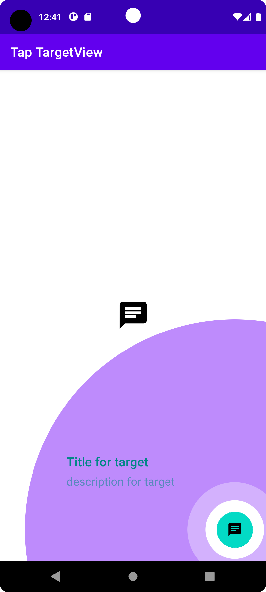
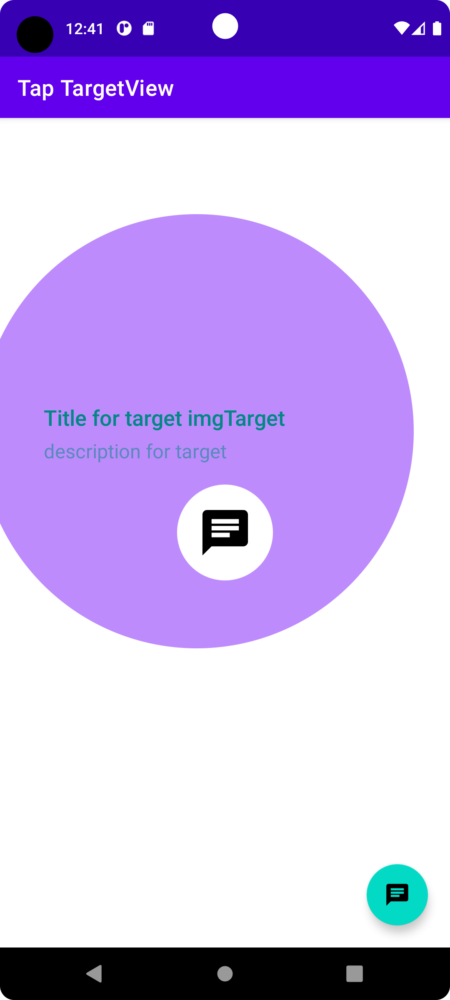

# Tap Target View

Tap Targets are animation views for Android that highlight specific views. You can use it with views that are important to you.
Also, I will use Sharedpreferences for showing Target View , so I want to show this feature once to the user and then there is no need to show it again after the first run.

   
 &nbsp;&nbsp; 